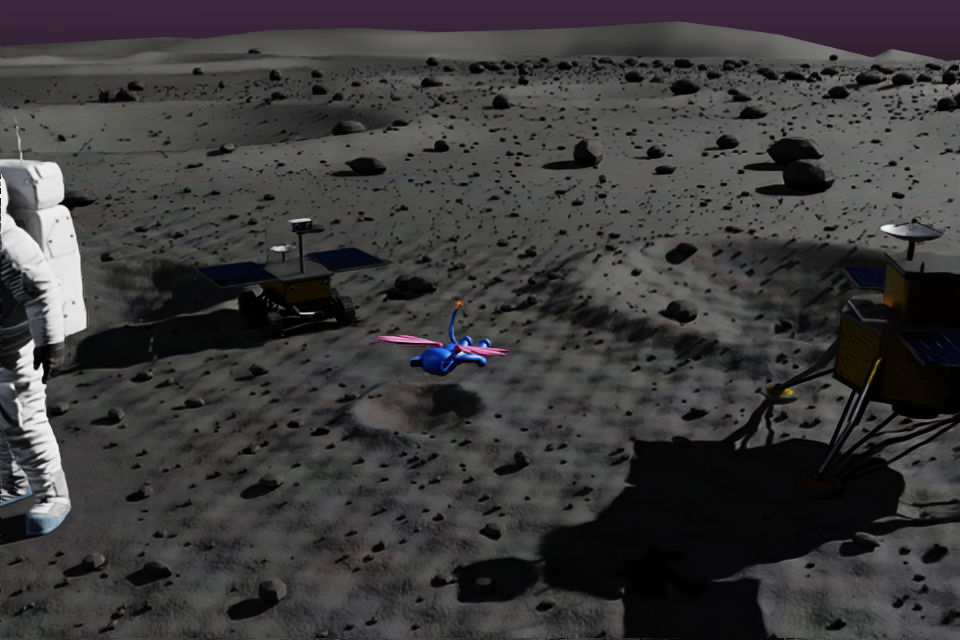
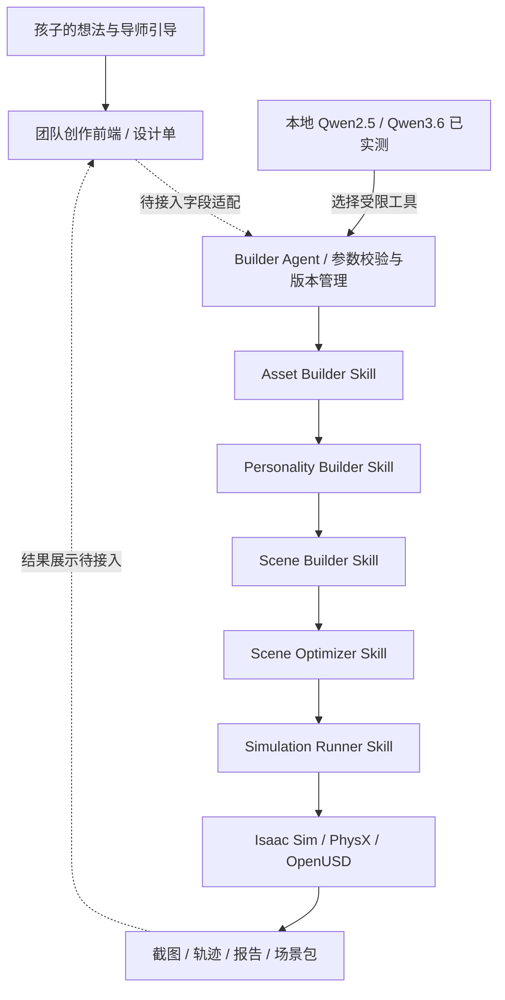

# AI造物·青少年机器人创作平台

## Unbound Maker

**让每个孩子，都能造出自己的机器人伙伴**

一个孩子想做的机器人，可能是一只有翅膀的猫：平时有点调皮，生气时会露出小尖牙，还想去月球看看。

我们希望孩子能把这些想法说出来、画下来，再参与决定它的样子、性格和玩法。先做出一个能看见、能操作的作品，再试着修改它。飞行喵是这条创作路径的第一个案例。

Unbound Maker 将角色构建、表情、场景、优化和仿真封装成五个 Skill，由 Builder Agent 组织执行。运行底座是 NVIDIA DGX Spark、Isaac Sim / PhysX 和 OpenUSD。当前支持已有飞行猫模板及三个场景，逐步接入团队的创作引导前端。

[参赛说明](SUBMISSION.md) · [Agent 使用与 API](agents/builder/README.md) · [Spark 部署](docs/builder-agent-spark.md) · [验证记录](verification/builder-agent-ledger.md)

> 版本：0.1.0 开发版。2026-09-29，五个 Skill、结构化构建与真实 Isaac 仿真已通过；Spark 本地 Qwen2.5-7B 已通过 CLI 和最小网页入口的真实模型驱动链路。Qwen3.6-35B-A3B（Q4_K_M）已下载并通过独立 Agent 集成及推力修改复用测试，尚未单独进行网页验收。见 [Qwen2.5](verification/builder-agent/qwen25-acceptance.md)、[Qwen3.6](verification/builder-agent/qwen36-acceptance.md)和[网页验收](verification/builder-agent/frontend-acceptance.md)。团队发布检查另行记录，不代表 NVIDIA 官方认证。

> 本次提交以 Qwen3.6 为目标模型，Qwen2.5 记录仅保留为早期链路证据，不是发布前必须切回的模型。追加提示词评测曾出现 CUDA 非法内存访问；使用同一权重、`num_batch=128` 后 Runner 六题均返回，物理计算与报告边界题已复核，但这不等于完整稳定性验收。可选配置见 [Qwen36-Spark.Modelfile](agents/builder/Qwen36-Spark.Modelfile)。本版先提交开发源码，未关闭项见[源码发布验收](verification/release-20260929/README.md)；资产原文件不随源码分发，见[资产准备清单](docs/asset-distribution.md)。



上图来自本版 Builder 的结构化链路实测，并非概念渲染图，也不作为真实模型调用成功的证据。

## 从孩子的想法开始

创作可以从很具体的愿望开始：“我想让它会飞”“我想给它换个颜色”“我想带它去月球”。这些是需求示例，不作为已经验证的访谈引语或研究结论。

团队的产品设计保留孩子和家长两个入口。孩子表达外观、个性、功能和游戏规则；家长或导师帮助确认能力范围、内容边界和分享权限。平台把需求整理成设计单，再将受支持的字段交给构建端。

遇到暂时做不到的要求，应该说明缺少哪项能力，保留为下一步创作目标。我们不希望孩子刚提出想法，就先被技术条件挡住；也不希望用一张效果图代替已经做出的功能。

## 核心亮点与技术创新

1. **把创作拆成可执行、可检查的五项能力。** 一个 Builder Agent 负责理解受支持的需求，五个 Skill 分别处理角色、表情、场景、优化和运行。模型提出动作，程序检查参数和真实产物，失败不能靠一句“完成了”跳过。
2. **同一角色进入故事和实验两条路径。** 草地与太阳系承载故事；月球场景提供地球、月球、无重力对照。孩子可以改质量与推力，观察差异。角色腿部动画与物理运动分别说明，不把动画包装成训练成果。
3. **OpenUSD 贯穿资产到运行。** 引用、payload、PointInstancer、LOD variants 与独立覆盖层组织场景；Runner 负责动态 LOD。优化时保留碰撞和近景需求，而不是只追求更小的文件。
4. **修改作品时复用已有成果。** 设计单形成不可变版本，缓存按规范化参数、Skill 内容及上游哈希校验。只改推力可复用前四步，但仿真必须重新运行，返回新截图和报告。
5. **在 Spark 本地完成有证据的执行。** 本地模型经受限工具驱动实际 Isaac Sim；任务有取消、超时和清理，模型、结构化路径和测试替身明确区分。源码、授权角色与外部素材分项管理。

这些是本项目的工程设计与整合特点，不宣称提出新的训练算法。资源收益只报告已有结构计数，不凭实例化或文件大小推导 GPU 节省比例。

## 架构总览


[可编辑 SVG](docs/architecture.svg) · [图示范围说明](docs/architecture.md)

## 两种模式

| 模式 | 孩子可以做什么 | 当前实现 |
| --- | --- | --- |
| 故事模式 | 带着角色在草地上活动，或到太阳系飞行，安排一段冒险 | `meadow`、`space` 预置场景；移动、起飞、视觉步态和表情控制接入运行时 |
| 实验模式 | 比较地球、月球和无重力条件下的运动，改变质量和向上推力，再看结果 | `moon` 月球场景；5 / 10 / 20 秒实验，默认 10 秒；输出截图、轨迹和检查报告 |

故事模式使用预设；月球实验开放重力环境、质量和推力。月球营地保留宇航员、月球车和着陆器。

当前飞行通过施加向上外力实现，腿部动作是骨骼动画。实验用于观察参数变化，尚未验证扑翼空气动力学，也没有训练双足平衡或真实机器人策略。太阳系场景采用游玩比例，不用来证明天体大小和距离的真实比例。

## 一个 Builder Agent，五个构建 Skill

本仓库交付一个独立 Python Builder Agent 和最小构建网页。团队概念页可由操作者单独提供，在隔离预览中展示；新版面板负责提交需求、显示进度与真实结果。Qwen2.5 的网页到仿真链路已验收，完整创作引导与作品社区尚未合并。



| Skill | 当前负责的工作 | 入口 |
| --- | --- | --- |
| Unbound Maker Asset Builder | 从 `flyingcat-v1` 模板构建角色，修改身体主色和整体比例，整理骨骼、材质与依赖 | [Skill](skills/unbound-maker-asset-builder/SKILL.md) · [部署](docs/asset-builder-spark.md) |
| Unbound Maker Personality Builder | 默认自然表情；独立转头、轻微歪头；自然 / 好奇 / 生气三种手动表情 | [Skill](skills/unbound-maker-personality-builder/SKILL.md) · [部署](docs/personality-builder-spark.md) |
| Unbound Maker Scene Builder | 将角色放入草地、太空或月球模板，整理可搬迁的场景依赖 | [Skill](skills/unbound-maker-scene-builder/SKILL.md) · [部署](docs/scene-builder-spark.md) |
| Unbound Maker Scene Optimizer | 检查实例化、payload、LOD 变体、材质和碰撞结构；以独立覆盖层调整已有远景 LOD | [Skill](skills/unbound-maker-scene-optimizer/SKILL.md) · [部署](docs/scene-optimizer-spark.md) |
| Unbound Maker Simulation Runner | 限时启动、查询与停止 Isaac；接入移动、动画、动态 LOD 和物理参数；生成运行证据 | [Skill](skills/unbound-maker-simulation-runner/SKILL.md) · [部署](docs/simulation-runner-spark.md) |

Skill 是可复用的执行能力，不必各自启动一个模型。Asset Builder 的输出是视觉资产，Runner 才加入当前使用的力控制胶囊碰撞体。此版本不输出完整关节机器人 URDF，也不宣称完整 SimReady 机器人生成。

### Builder 怎样工作

自然语言模式使用本地 OpenAI 兼容端点，模型提议参数补丁和下一项工具动作。自研 Harness 校验字段、依赖顺序、权限和真实产物，最多执行 12 轮模型决策，允许一次计划或格式修复。

结构化模式直接接受设计单，调用相同的五个 Skill，不依赖模型。报告分别标记 `agent` 和 `structured`；测试替身只能标记 `mock`。模型不可用时任务失败，不会悄悄换成假结果。

每次修改形成新版本。只改变月球推力时，前四步可以复用，再创建新的运行任务；改变角色颜色或缩放时，需要重建受影响的下游产物。复用前仍检查文件清单和 SHA256。模型生成的 `code_stub` 不会被执行，用户也不能提供任意 shell 命令、模型端点或文件路径。

## OpenUSD 与场景复用

场景沿用已有的可复用资产和程序化布局。草、碎石等重复内容使用 PointInstancer；通过引用、payload 和相对依赖组织场景；近远景由已有 LOD variants 表达。Optimizer 保留基础文件，以覆盖层记录调整，Runner 再按运行时距离切换。

碰撞体与装饰细节分开检查。降低远景显示复杂度时，不应同时删掉地面或岩石的碰撞结构。月球近景需要特写，默认保留地形细节。

这些方法减少重复描述，并控制加载和显示范围。具体 GPU 内存、帧率和加载时间收益仍需测量；文件包小、实例数量减少，都不能直接换算成显存节省比例。

## 当前验证结果

| 对象 | 已有证据 | 仍未证明的部分 |
| --- | --- | --- |
| Asset Builder | Mac / Spark 各 14 项测试通过，真实 USD 样例构建 | 任意图生机器人、物理关节与 URDF |
| Personality Builder | Mac / Spark 各 16 项测试通过 | 自动情绪识别、实体触摸交互 |
| Scene Builder | Mac / Spark 各 10 项测试通过，三个场景构建成功 | 任意文字生成全新世界 |
| Scene Optimizer | Mac / Spark 各 13 项测试通过，保护对象及依赖检查通过 | GPU 内存和 FPS 收益 |
| Simulation Runner | Mac / Spark 各 13 项测试通过；三个场景及月球地球重力对照完成真实 Isaac 自动运行 | 真人键盘 / UI 完整验收、训练后关节控制 |
| Builder Agent | 26 项回归测试；Qwen2.5 网页链路、Qwen3.6 独立 Agent 集成及推力修改复用通过，另有真实取消清理记录 | 完整创作前端、真人交互、Qwen3.6 网页验收 |

详细范围见 [Asset](verification/asset-builder-0.1.0.md)、[Personality](verification/personality-builder-0.1.0.md)、[Scene](verification/scene-builder-0.1.0.md)、[Optimizer](verification/scene-optimizer-0.1.0.md)、[Runner](verification/simulation-runner-0.1.0.md) 和 [Builder 执行记录](verification/builder-agent-ledger.md)。这些是对应版本的开发测试，尚不等于完整 Skill 发布验证。

## 在 Spark 上运行

首次完整复现需要 DGX Spark、可工作的 Isaac Sim、兼容的 USD Python 环境，以及登记的场景模板和贴图。模型与大体积场景素材不随源码包分发；模板获取和公开授权仍是发布前待完成项。当前还不是干净机器上下载即用的公开发行包。

Builder 本身只使用 Python 3.10+ 标准库。CPU USD 构建和 Isaac 运行使用各自明确的解释器与进程级环境，不能把开发机的 USD wheel 强行装入 Isaac 环境。

在仓库根目录，先运行不需要 USD / GPU 的 Builder 回归测试：

```sh
python3 -m unittest discover -s agents/builder/tests -v
```

检查并修改 [Spark 配置示例](agents/builder/operator.spark.example.json)中的解释器、模板、状态目录和模型路径。该文件记录开发机安装位置，其他机器不能直接照抄。

准备好依赖后，可运行真实结构化验收。它会启动两次限时仿真，包括只改推力的复用测试：

```sh
python3 agents/builder/tests/integration_spark.py \
  --config agents/builder/operator.spark.example.json \
  --mode structured
```

Qwen3.6-35B-A3B（`qwen3.6:35b-a3b`，Ollama Q4_K_M，不是 FP8）已完成下载和独立 Agent 集成：蓝色角色、月球、2kg、7N、10 秒自动仿真，以及改成 11N 后复用前四个构建阶段。已有缓存被复用，Runner 真实新运行；这不代表全部资产重新生成，也不是普遍成功率。[Qwen3.6 验收范围](verification/builder-agent/qwen36-acceptance.md)。Qwen2.5 已验证的网页演示保持不变。安装方式见 [Agent README](agents/builder/README.md)；运行时明确配置实际模型。

前端可通过本机 HTTP API 提交任务、轮询进度和领取截图、报告及场景 ZIP。API 仅监听 `127.0.0.1`，要求 bearer token；Mac 使用 SSH 隧道连接。没有部署公网访问或网页实时串流。[接口及 CLI 文档](agents/builder/README.md#frontend-api)列出了调用方法。

## 技术栈

| 技术 | 本版用途与状态 |
| --- | --- |
| NVIDIA DGX Spark / GB10 | 真实构建与仿真测试设备，Linux aarch64 |
| NVIDIA Isaac Sim 5.1 / PhysX | 场景渲染、碰撞、重力和外力驱动，已有运行证据 |
| OpenUSD | 角色、骨骼、材质、场景组合、实例化、payload、variants 和 session layer |
| Python / SQLite | 自研 Harness、持久化队列、版本与缓存、固定 Skill CLI、本机 API |
| Ollama / Qwen2.5-7B | 本地真实模型驱动五个 Skill 与 Isaac 验证已实测一次，含一次格式修复 |
| Qwen3.6-35B-A3B / Q4_K_M | 已下载；Spark 独立 Agent 集成及推力修改复用通过；网页验收未单独进行 |
| StepFun、Isaac Lab、Cosmos、ROS 2 | 本版主线尚未接入，不计为已使用技术 |

Ubuntu 是运行环境，不是仿真引擎。团队前期 MuJoCo、Unity 和其他交互示例保留在原项目中，不计入本仓库已接通的 Isaac 主线。也没有另行开发 CUDA 内核或完成模型微调。

## 项目目录

```text
README.md                 项目入口
SUBMISSION.md             参赛说明、证据索引与提交清单
agents/builder/           Builder Agent、配置示例、API 与测试
skills/                   五个 Skill、Skill Card、Benchmark 与评测用例
docs/                     各模块部署和接口说明
verification/             测试记录、截图及运行报告
```

`artifacts/`、`dist/`、模型缓存和运行数据保留在开发环境，不自动提交 Git。每个作品的完整依赖目录要一起搬迁，不能只取一个 USD 入口文件。

## 团队、来源与发布

项目仓库：[UnboundMakers/unbound-maker-dgx-spark](https://github.com/unboundmakers/unbound-maker-dgx-spark)。本次仅发布代码、Skill、文档及已批准展示的预览图，不分发角色和场景原始资产。项目展示名为“AI造物·青少年机器人创作平台”，slogan 为“让每个孩子，都能造出自己的机器人伙伴”；Unbound Maker 保留为工程与 Skill 命名前缀。自研代码采用 [Apache-2.0](LICENSE)，文档和 Skill 说明采用 [CC BY 4.0](LICENSES/CC-BY-4.0.txt)，两者均允许按协议商业使用。正式全文已补齐；具体范围见 [LICENSING.md](LICENSING.md)，第三方来源见 [THIRD_PARTY_NOTICES.md](THIRD_PARTY_NOTICES.md)。角色和演示图像不在默认开放授权内。

许可参考：[NVIDIA Skills](https://github.com/NVIDIA/skills#license) 将源码按 Apache-2.0、文档与 Skill 内容按 CC-BY-4.0 授权；[Isaac Sim 仓库代码](https://github.com/isaac-sim/IsaacSim/blob/main/LICENSE)采用 Apache-2.0，但 Kit SDK、模型和贴图另有条款；[Isaac Lab](https://github.com/isaac-sim/IsaacLab/blob/main/LICENSE)采用 BSD-3-Clause。NVIDIA 并非所有产品统一适用一个许可。这些项目的许可也不等于赛事指定的许可；现有赛事材料要求开源提交，未见指定具体协议。

飞行猫的项目展示授权已由项目负责人确认；角色原画、模型、贴图及角色专用生成数据不纳入代码授权，不随公开源码分发。公开展示不向第三方授予角色复用权，法定例外除外。公开复现需另备允许使用的通用示例角色，目前尚未完成替换。第三方素材保持各自原许可，本项目不代原作者扩大授权；按具体资产登记来源、下载入口、署名要求和使用条件。

项目由 AI 造物社区团队推进，GitHub 组织为 [UnboundMakers](https://github.com/UnboundMakers)。教育定位、孩子与家长的表达入口、设计单和作品社区思路承接团队的 [DGX-AI-GO 项目](https://github.com/charinkers/DGX-AI-GO)。该分支已有独立前端与交互模块，本仓库当前交付 Builder 和五个构建 Skill，尚未复制或合并其代码；上游测试成绩不计作本版集成结果。

孩子的原创角色、团队代码和第三方场景素材分别登记来源。代码与文档许可已确定；发布前仍需核对角色署名及逐项素材分发范围。不将全部资产统一标为 CC0，也不上传孩子的原始问卷、个人对话、私有作品、密钥或家庭网络信息。源码提交排除角色源模型、运行数据和旧构建 ZIP，保留原文件在本地，不破坏已验证的 Spark 环境。

自研 Skill 按登记、扫描、评测、团队签名和文档五项准备源码发布候选。双端回归、Bandit 扫描及有限提示词对照已执行，仍有未关闭的模型复测与完整行为评测项，详见[本轮验收](verification/release-20260929/README.md)。签名只覆盖冻结包，不意味着所有能力验证通过；不使用 NVIDIA 官方认证标识。

## 下一步

1. 保留 Qwen2.5 已通过的网页演示和 Qwen3.6 独立 Agent 验收证据，不临时更换演示配置。
2. 在已通过的最小网页入口上继续整合创作前端，扩充受支持字段并完成真人交互验收。
3. 完成 Skill 发布验证、素材与许可证整理，录制演示后公开提交。
4. 后续再扩展角色模板、可动关节与 URDF、Isaac Lab 动作学习，以及实体制作。课程效果与真实硬件迁移需要另外验证。

AI 造物社区，一起用 AI 和硬件把想法做出来。
