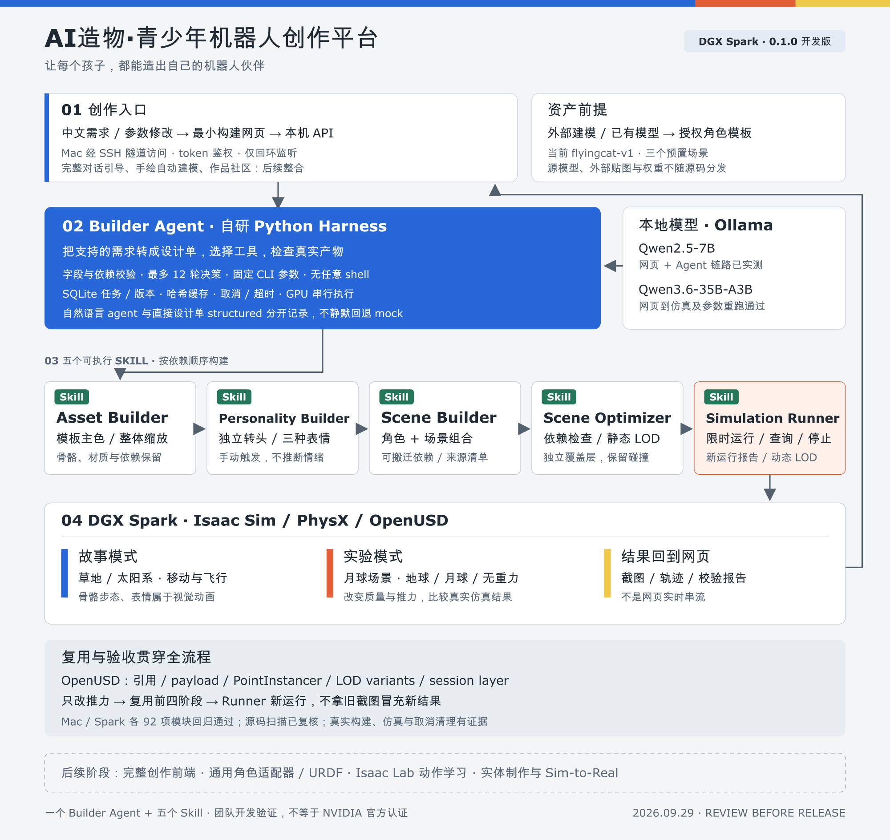

# AI造物·青少年机器人创作平台 · 参赛说明

**让每个孩子，都能造出自己的机器人伙伴**

第三届 NVIDIA DGX Spark 黑客松 · Agent Skills 开发挑战赛  
版本：0.1.0 开发版 · 2026-09-29

## 1. 项目介绍

AI 造物关注青少年怎样把自己的想法做成作品。孩子描述机器人时，常常先说它长什么样、是什么性格、想和它玩什么。我们希望保留这种表达方式，让孩子参与提出需求、确认设计、观察结果和修改作品。平台服务于导师带领的机器人创作与 AI 造物课程，把抽象的技术概念放进孩子愿意反复尝试的作品里。

本次案例是一只有翅膀的飞行猫。它有自然、好奇和生气三种表情，可以独立转头，在草地和太空场景中活动，也可以进入月球实验。故事模式给创作者安排角色和冒险的空间；实验模式把重力、质量、推力等参数开放出来，让同一个角色在不同条件下运行。例如，保持角色质量和向上推力不变，只改变重力环境，就能观察到不同的运动结果。实验后的截图和轨迹可用于讨论，而不只展示一段动画。

平台采用 Agent 与 Skills 分工。创作引导端整理孩子的需求，Builder Agent 负责将受支持的参数交给具体工具。我们将创作过程封装为五个独立 Skill：Asset Builder 构建角色外观，Personality Builder 处理头部和表情，Scene Builder 组合场景，Scene Optimizer 检查和调整场景结构，Simulation Runner 在 Isaac Sim 中限时执行并返回结果。每一步都有输入约束、输出清单和结果检查。

DGX Spark 承担本地执行。OpenUSD 组织角色、材质和场景依赖；Isaac Sim / PhysX 负责渲染与外力、重力实验。角色和场景按版本保存，修改推力可以复用已有资产，修改外观则重建相应部分。任务支持取消、超时和结果校验，模型提出的动作必须通过程序检查，并产出真实文件和报告。

当前实现基于授权飞行猫模板与草地、太空、月球三个预置场景。Qwen3.6-35B-A3B 已在 Spark 上完成网页端到端验证：从中文需求生成受支持的设计参数，组织五个 Skill，启动真实 Isaac 仿真，并在网页返回截图和报告。网页将推力从 7N 改为 11N 后，前四个构建阶段复用，Runner 重新仿真。两次运行各通过 11 项检查。

平台提供一个最小构建网页，支持中文需求、任务进度、取消、结果展示及报告下载。它通过本机 API 与 SSH 隧道连接 Spark。角色的步态和表情属于视觉动画；实验中的移动由 PhysX 外力控制产生。这样的分层让孩子先看到自己的角色活动起来，再通过明确的参数对照理解作品的运行方式。

## 2. 核心亮点与技术创新

| 创新点 | 工程实现 | 实测依据 |
| --- | --- | --- |
| 创作需求落到可执行工具 | 自研 Builder Agent 编排五个 CLI Skill，校验参数与真实产物 | Qwen3.6 网页到真实仿真及参数重跑通过 |
| 故事与实验共用角色 | 草地、太阳系故事；月球场景切换地球、月球、无重力 | 三场景运行与重力对照 |
| OpenUSD 资产复用 | 引用、payload、PointInstancer、LOD variants、session layer 与独立覆盖层 | 依赖、结构与碰撞保护检查 |
| 参数修改不重复整套构建 | 不可变设计版本、依赖哈希缓存；Runner 每次新运行 | 7N 改 11N 时前四阶段复用 |
| 执行结果可核对 | 任务身份、文件哈希、报告、日志与截图共同确认结果 | 回归、真实取消清理与运行报告 |

这些创新点来自创作场景与工程工作流的整合。性能说明使用实际结构计数，模型结果对应具体测试案例。

## 3. 架构与 Skill 设计



[可编辑 SVG](docs/architecture.svg)

一个 Builder Agent 负责受支持需求的参数规划和工具编排，五个 Skill 负责具体执行：

| Skill | 输入与职责 | 产物 |
| --- | --- | --- |
| Asset Builder | 已有角色模板、主色、整体比例 | USD 角色与 manifest |
| Personality Builder | 已有角色、手动表情与头部控制 | 表情覆盖层、配置与运行模块 |
| Scene Builder | 角色和草地、太空、月球模板 | 可搬迁场景与依赖清单 |
| Scene Optimizer | 受信任场景、保留或预览策略 | 优化覆盖层与结构报告 |
| Simulation Runner | 场景、实验参数、运行时限 | 新截图、轨迹与运行报告 |

Agent 使用 Python 标准库和 SQLite 实现队列、不可变版本及事件记录。本地模型通过 OpenAI 兼容接口返回 JSON 动作；Harness 对动作、依赖顺序和参数范围进行校验。执行固定命令参数列表，不运行模型提供的任意 shell。

任务串行运行并使用 GPU 锁。API 只监听回环地址，使用 token 鉴权；调用者只能获取登记且哈希匹配的产物。取消操作只管理已确认属于本任务的进程组。

## 4. NVIDIA 平台与模型

| 技术 | 本次用途 |
| --- | --- |
| NVIDIA DGX Spark / GB10 / Linux aarch64 | 本地模型推理、资产构建与仿真 |
| NVIDIA Isaac Sim 5.1 / PhysX | RTX 场景渲染、碰撞、重力与外力 |
| OpenUSD | 骨骼、材质、引用、payload、实例化、LOD 与覆盖层 |
| Ollama 0.34.4 | 独立安装的本地推理服务 |
| Qwen3.6-35B-A3B / Q4_K_M | 本次使用模型；`num_batch=128` 网页端到端与推力重跑已实测 |
| Qwen2.5-7B / Q4_K_M | 早期 CLI 与网页链路实测 |
| Python / SQLite / HTML / CSS / JavaScript | Harness、Skill、存储、本机 API 与最小前端 |

资源管理采用串行 GPU 作业、模型单并发、推理和运行时限，以及按依赖复用资产。可选 Spark 模型配置使用相同 Qwen3.6 权重和 `num_batch=128`，见 [Modelfile](agents/builder/Qwen36-Spark.Modelfile)；运行注意事项见[部署说明](docs/builder-agent-spark.md)。

在已记录的 Optimizer 草地预览测试中，PointInstancer 放置数从 42,327 变为 37,647，碰撞 prim 数保持 84；太空预览可见网格点数从 109,949 变为 71,878，碰撞 prim 数保持 9。这些是结构计数，不等同于显存或 FPS 收益。[结构报告](verification/scene-optimizer-0.1.0.md)

## 5. 已完成验证

Mac 与 Spark 分别执行以下模块回归，每个平台共 92 项通过：

| 模块 | 每个平台通过数 |
| --- | ---: |
| Asset Builder | 14 |
| Personality Builder | 16 |
| Scene Builder | 10 |
| Scene Optimizer | 13 |
| Simulation Runner | 13 |
| Builder Agent | 26 |

真实链路验证：

- Qwen3.6：网页中文需求、五个 Skill、真实截图、报告下载，以及 7N 改为 11N 的参数重跑；两次月球 10 秒仿真均通过 11 项检查。[记录](verification/builder-agent/frontend-qwen36-acceptance.md)
- Qwen2.5：中文需求到五个 Skill、真实截图、报告下载及参数重跑的浏览器链路。[记录](verification/builder-agent/frontend-acceptance.md)
- 真实取消：观察到 Isaac 运行后取消，检测到的剩余 Isaac 进程为空。[记录](verification/builder-agent/cancel-3722c4ba551449db8e2c8675e888de28.json)
- 重力对照：同为 2kg、7N，月球与地球条件在模拟时间 3.5–5 秒的最大角色 Z 分别为 2.933m 和 0.035m；地球组产生推力不足提示。[记录](verification/simulation-runner-0.1.0.md)
- 源码检查：Bandit 扫描与人工复核、常见密钥初筛、角色及外部资产排除检查。[团队验证记录](verification/release-20260929/README.md)

以上按各测试的版本、环境和范围报告，不把模块用例数量当作模型成功率。采用团队实测口径，不使用 NVIDIA 官方认证标识。

## 6. 本地部署

运行前配置 Python 3.10+、可工作的 Isaac Sim、兼容的 CPU USD 环境、本地模型与登记的授权模板资产。Agent 本身只依赖 Python 标准库。模型权重和角色、场景原资产独立准备，详见[资产清单](docs/asset-distribution.md)。

按实际安装位置修改 `agents/builder/operator.spark.example.json`，然后在仓库根目录运行：

```sh
python3 -m unittest discover -s agents/builder/tests -v

python3 agents/builder/tests/integration_spark.py \
  --config agents/builder/operator.spark.example.json --mode agent
```

第二条命令会启动限时真实 GPU 仿真，应先确认设备没有其他 Isaac 作业。网页/API、鉴权和 SSH 隧道配置见 [Agent 使用说明](agents/builder/README.md)。

## 7. 提交内容与评分对应

项目地址：[UnboundMakers/unbound-maker-dgx-spark](https://github.com/unboundmakers/unbound-maker-dgx-spark)

仓库包含项目介绍、架构图、五个 Skill、自研 Builder Agent、最小网页、部署说明、验证记录与许可证。

黑客松征文：[一个女孩想要一只会飞的猫，我们决定陪她做出来](docs/hackathon-story.md)。

| 评分项 | 权重 | 项目对应内容 |
| --- | --- | --- |
| 实用性、落地价值与创新性 | 25% | 青少年创作、导师课程、故事与实验双模式 |
| Agent 与模型优化技术深度 | 25% | 受限工具编排、参数规划、资产复用与资源控制 |
| 项目完整性 | 20% | 五个 Skill、Agent、最小网页、运行证据及文档 |
| 平台适配性 | 15% | Spark ARM64、本地推理、Isaac Sim 与 OpenUSD |
| 演示效果 | 10% | 真实场景、运行截图、参数对照与版本复用 |
| 赛事征文 | 5% | 以真实开发过程和测试记录组织分享 |

视频、团队资料及文章链接由团队在组委会表单中统一填写。

## 8. 团队与资产授权

团队的 [DGX-AI-GO 项目](https://github.com/charinkers/DGX-AI-GO)提供教育定位与创作引导思路，本仓库交付 Spark 端构建与仿真执行能力。创意参与者提出角色外观、个性、故事与玩法；前端团队整理交互与设计单；构建团队负责 Agent、Skill、OpenUSD 和 Isaac 运行。

自研代码采用 [Apache-2.0](LICENSE)，文档和 Skill 说明采用 [CC BY 4.0](LICENSES/CC-BY-4.0.txt)。孩子原创角色与第三方素材单独管理：飞行猫仅按授权展示，不随源码开放原画、模型或贴图；外部资产按来源和各自条款准备。[授权范围](LICENSING.md) · [第三方来源](THIRD_PARTY_NOTICES.md)

当前执行对象为授权角色模板；步态和表情是视觉动画，实验以外力驱动简化碰撞体。模板构建、物理实验与真实机器人制作具有不同的技术范围。

AI 造物社区，一起用 AI 和硬件把想法做出来。
