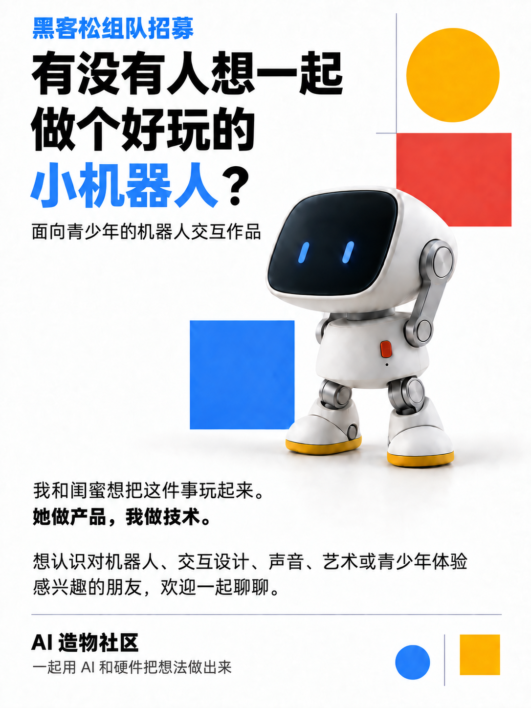
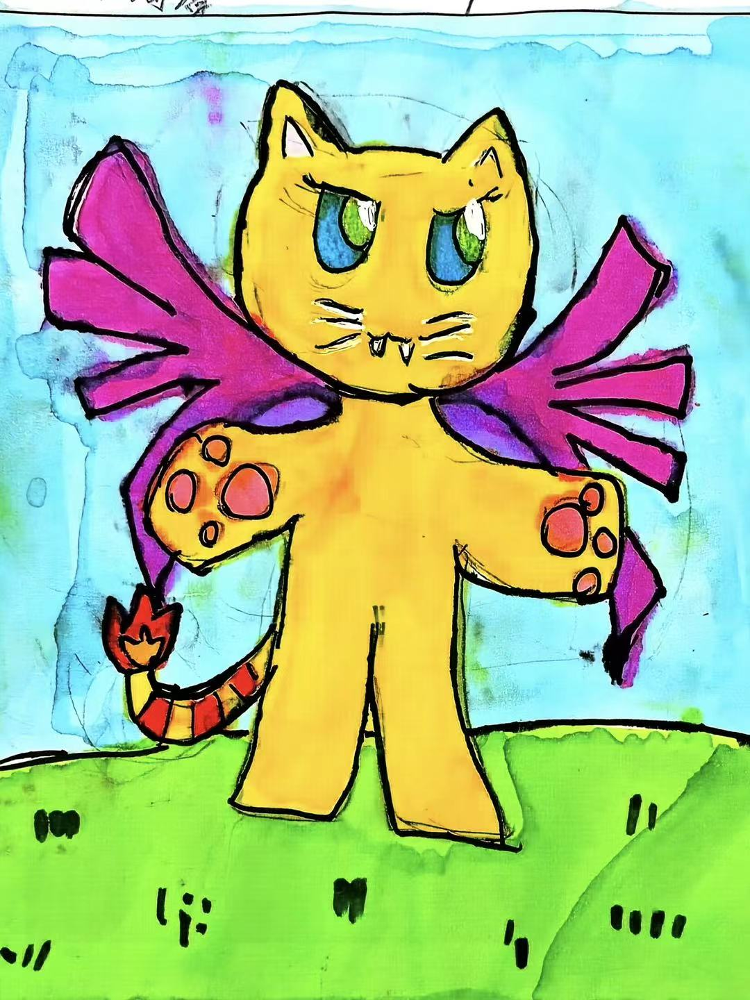
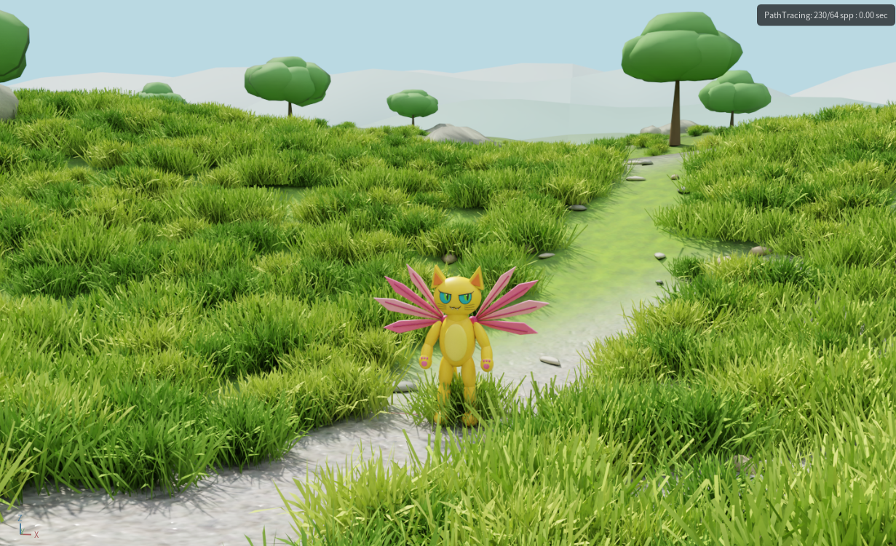
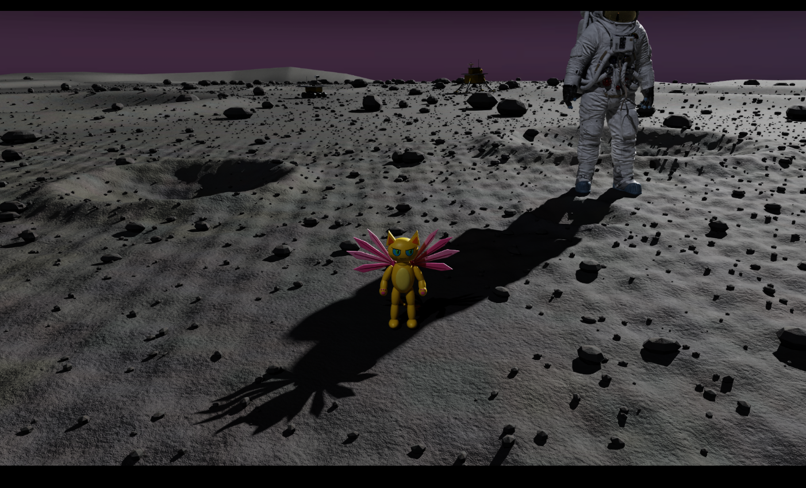

# 一个女孩想要一只会飞的猫，我们决定陪她做出来

我和闺蜜 Caren 一直想从机器人的角度尝试一些新的东西。她曾在头部机器人企业担任产品经理，关注人与机器人之间的交互；我负责技术，长期做机器人架构和物理仿真。我们想知道，借助现在的 AI，能不能让更多年轻人参与机器人创作，从自己的想法开始设计？

正好看到 Spark 黑客松，我们决定试一试：做一个面向青少年的机器人创作平台，帮助孩子利用 AI，设计自己想要的机器人伙伴。

我们也希望更多女孩一起来做，于是在 The Unbound Makers「AI 造物」社区发出了招募。海报上写得很直接：“我和闺蜜想把这件事玩起来。她做产品，我做技术。”

Raid 和 Louis 加入了进来。我们又希望队伍里有熟悉教育、了解孩子的人，于是继续公开招募，遇到了晶晶。

晶晶在互联网大厂工作了 16 年，参与过许多教育项目，也经常带小朋友玩 AI 游戏。她自己就想带着女儿尝试 AI 硬件和动手实践。我们这支队伍，就这样从朋友之间的一个念头，慢慢组成了。

晶晶的小女儿想要一个会飞的机器人。

听到这个愿望，做机器人的大人很容易想到无人机。她想到的却是一只猫：黄色的身体，粉色的翅膀，可以和她一起玩。

她还画了一个关于这只猫的故事。猫想飞，却遇到了“禁止”的标志和不断阻止它的人。画里的猫有点生气，也很不服气，最后还是飞了起来。

我很喜欢这个想法。一个孩子提出会飞的猫，我们为什么急着告诉她“猫不能飞”？可以先听听，她为什么想要它，想和它一起做什么。至于怎样让它动起来、需要什么条件，我们可以陪她慢慢探索。

这只飞行猫，后来成为了我们参加 NVIDIA DGX Spark 黑客松的一个创作案例。

组队之后，我们聊了很多。机器人可以是什么形态？要怎样与孩子交流？孩子说“可爱”，具体指什么？一个机器人除了执行动作，还能不能表现出性格？以前做科研时的一些想法，也在这些讨论中重新冒了出来。

有一次，我们讨论了很久：这个平台到底要不要以训练编程能力为目标？

晶晶的观察很具体。她和孩子们聊想要什么机器人时，他们描述的场景大多与玩有关。先给伙伴设定样子、起个名字，再想它可以陪自己做什么。对于这个阶段的孩子，创造的入口可以是一句话、一张画，或者几个容易理解的选择。

我们逐渐把体验设计清楚：先帮助孩子表达，再把这些表达整理成机器人的外形、行为与性格，让孩子看见结果，继续修改。技术团队要做的，是把这些环节接起来。

孩子已经画出了形象，也有自己的故事。我们开始根据她的创作搭建模型和场景，让这只猫进入一个可以探索的三维世界。

我们的原型围绕 DGX Spark 开发，利用本地 AI 能力辅助设计，并在 NVIDIA Isaac Sim 中搭建场景、测试机器人的行为，把孩子的表达与物理仿真连接起来。对孩子而言，入口应当简单；模型生成、场景搭建和动作控制这些复杂的工作，由平台在背后处理。

我们先做了户外场景。飞行猫可以在里面移动、起飞、落下，绕着环境探索。地面和石头有碰撞约束，它不能随意穿过去，操作者需要调整路线和动作。

我自己调试的时候，越玩越觉得有意思。为什么它飞起来时身体是竖着的？尾巴应该怎么动？落地之后能不能更自然？做出来一点，就又想改一点。那些关于动作和形态的问题，是在操控它的过程中一点点出现的。

我觉得这很适合成为孩子接触机器人设计的方式：先有一个自己想要的伙伴，看着它动起来，再带着问题继续试。

顺着飞行猫的故事，我们又延展了太阳系探索和月球场景。既然它想飞，为什么只让它停留在地面上的一个地方？它还可以陪着孩子进入一个想象中的太空旅程。

这里也给了我们讨论科学的机会。太空中的漂浮和月球表面的运动不同，月球仍然有重力，翅膀也不能像在地球上一样依靠空气飞行。我们可以保留故事里的飞行设定，同时在实验中改变条件，观察动作会怎样变化，讨论真正实现它还需要哪些设计。

用仿真把角色飞起来，是创作的第一步。要做成现实中的机器人，还需要动力、结构和控制等进一步验证。孩子可以从故事开始，随着兴趣加深，再逐步走向这些工程问题。

这次黑客松的时间很有限，我们先选择飞行猫和几个场景，把基本的创作过程串起来。界面、表达引导和仿真需要反复对齐，也有不少功能还要继续完善。我们想先让一个真实的孩子的想法，在这个原型里有一个可以看见、可以操作的样子。

飞行猫只是一个开始。下一个孩子想要的伙伴，可能完全不同。它可以安静，也可以好奇；可以长着翅膀，也可以只有两条腿。我们希望平台能给这些不同的想法留下空间，让孩子决定它长什么样、怎样回应、和自己一起做什么。

我喜欢这次共创的过程。做技术的人、做产品的人、熟悉教育的人，还有带着图画和故事来的孩子，都在参与同一件事。我们听她的想法，再一起想办法把它做出来。

我们的愿景，就是希望每个孩子都能造出心目中的那个机器人伙伴。现在，我们先从这只飞行猫开始。
